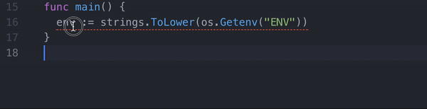

# Go Print

Atom extension so you can stop typing

```go
fmt.Println("VAR %v ", VAR)
```

## Install

```sh
apm install go-print
```

## How to use

Simply highlight your text and

```sh
ctrl+alt+l
```

## Demo


